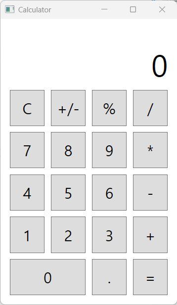

# Calculator-wpf
A simple calculator application built with WPF and C# to learn the fundamentals of .NET desktop development.

## ✨ Features
Standard arithmetic operations (+, -, *, /)

Chained calculation support (e.g., 7 + 5 * 2 = 24)

Decimal point input

Sign toggle (+/-) functionality

Keyboard input support

Secondary display for showing the ongoing equation

## 📚 What I Learned
Framework: WPF (.NET)

Language: C#

UI: XAML (Grid Layout, Controls, Properties)

Core Concepts: Event Handling, Code-Behind, State Management, Refactoring, Basic UX consideration.

## 📸 Screenshot

